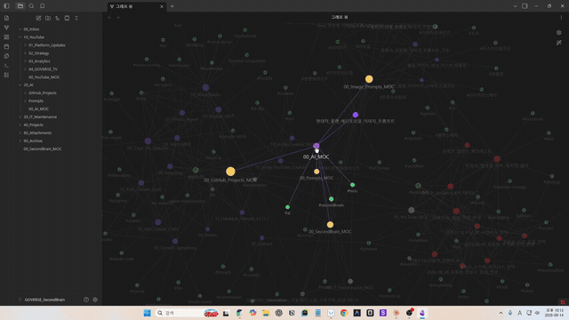

<div align="center">

# 🔒 Graph Highlight Lock

**A highlight that doesn't disappear when your mouse moves.**
Pin the hover-highlight of any node in Obsidian's built-in Graph View with a single click, and watch your navigation trail stay lit up behind you as a colored path.

**[English](#english) · [한국어](#한국어)**

[](https://github.com/ruruoni1/obsidian-graph-highlight-lock/releases)
[](https://obsidian.md)
[](LICENSE)
[](package.json)



</div>

---

## English

It does not create a separate graph view — it works directly on top of the Graph View you already use, with zero extra setup.

### Why?

Obsidian's Graph View highlights a node's connections while your mouse hovers over it, but the highlight disappears the moment you move away. In a vault with hundreds or thousands of notes, that means freezing your mouse in place just to trace a note's connections — and following a chain of links means losing everything you've already seen the second you move on.

**Graph Highlight Lock** pins that highlight to a node. Move your mouse freely, follow a link to the next node, and lock that one too — **the entire path you took stays visible as a colored line**, so you always know how you got where you are.

### Core Features

| Action | Result |
|---|---|
| Hover a node | Default Obsidian behavior (neighbors/edges highlighted) |
| **Alt + Left Click** on a hovered node | **Locks** the current highlight — stays even after the mouse moves away |
| Alt + Click a connected neighbor | The lock extends — the **navigation trail stays visible as a colored line with a direction arrow**, so you can always see the path you took, in order |
| Alt + Click a node already on the trail | Walks the trail back to that point |
| Alt + Click an unrelated node | Starts a fresh trail |
| `Esc` | Clears the lock entirely |
| Alt + Click on empty space | Clears the lock entirely |
| Normal click / drag / zoom / right-click | **Completely unaffected** — all native Graph View behavior is preserved |

The trail's **color, thickness, and direction arrows** are all configurable in settings.
Works with both the Global Graph and Local Graph views.

### Commands

- `Graph Highlight Lock: Lock hovered node`
- `Graph Highlight Lock: Clear highlight lock`
- `Graph Highlight Lock: Toggle lock`

### Settings

- **Lock trigger**: the modifier key used to lock (default `Alt`; `Ctrl`/`Shift`/`Cmd` also supported)
- **Locked node marker**: shows the current locked trail in the top-left corner as `🔒 A → B → C`
- **Trail color**: color used for the trail (previously-locked nodes and their connecting edges)
- **Trail edge thickness**: thickness of trail edges, as a multiple of the native line thickness
- **Trail direction arrows**: show an arrow on each trail edge pointing in the order you locked the nodes

### Installation

**Graph Highlight Lock is available in Obsidian's Community Plugins directory.**

1. Open Settings → Community plugins → Browse.
2. Search for "Graph Highlight Lock".
3. Click Install, then Enable.

You can also install it via [BRAT](https://obsidian.md/plugins?id=obsidian42-brat) (useful for getting updates before they land in the directory), or manually:

1. Download `main.js`, `manifest.json`, and `styles.css` from [Releases](../../releases).
2. Create a folder `.obsidian/plugins/graph-highlight-lock/` inside your vault and put the 3 files there.
3. Enable "Graph Highlight Lock" under Settings → Community plugins.

### How it works

Obsidian's Graph View has no official public API. This plugin reuses the **existing highlight state of the internal PIXI-based renderer** (`getHighlightNode`, `onNodeClick`, etc.) instead of drawing its own graph — which keeps it lightweight and visually identical to the native Graph View.

That said, this relies on **undocumented internal APIs**, so it may break on future Obsidian updates. All such access is isolated in a single file, [`src/graph-adapter.ts`](src/graph-adapter.ts), so only that file needs to change if Obsidian's internals shift.

Keeping the trail visible works differently for nodes and links. Nodes get their own color function (`getFillColor`) replaced for as long as they're on the trail, so every time native code recomputes it, it lands on our color anyway. Links have no equivalent override point, so instead the link's own draw function is wrapped to always run the native draw first and apply our color/thickness/arrow right after — guaranteed to be the last write, every time. Neither approach uses a polling timer; both only ever touch the (small) set of nodes/edges actually on the trail, never the full graph.

### Building from source

```bash
npm install
npm run dev     # watch mode for development
npm run build   # production build (produces main.js)
```

Copy the built `main.js`, `manifest.json`, and `styles.css` into your test vault's `.obsidian/plugins/graph-highlight-lock/`.

### Roadmap

- Multiple simultaneous locks / trails
- Selectable connection depth (1–3 hops)
- Persisting lock state across sessions

### Author

**GOVERSE**

- 📺 YouTube: [@goverse82](https://www.youtube.com/@goverse82)
- ✉️ Email: [ruruoni1@gmail.com](mailto:ruruoni1@gmail.com)

Bug reports and feature requests are welcome in [Issues](../../issues).

### License

MIT

---

## 한국어

별도의 그래프 화면을 만들지 않습니다.
여러분이 **이미 쓰고 있는** Obsidian Graph View 위에서, 추가 설정 없이 그대로 동작합니다.

### 왜 필요한가요?

Obsidian Graph View는 노드에 마우스를 올리면 연결된 노드/링크가 강조되지만,
마우스를 떼는 순간 사라집니다.

노드가 몇백~몇천 개인 Vault에서 "이 노트가 뭐랑 연결돼 있었지?"를 확인하려고
마우스를 그 자리에 얼어붙은 듯 고정해야 했던 경험, 다들 있으실 겁니다.
연결된 노드를 하나씩 따라가 보고 싶어도, 마우스를 옮기는 순간 지금까지 본 게
다 날아가 버립니다.

**Graph Highlight Lock**은 그 강조 상태를 노드에 고정(Lock)합니다.
마우스를 자유롭게 움직이며 연결 관계를 탐색하고, 링크를 따라 다음 노드로
넘어가면 — **지나온 경로 전체가 색깔 있는 선으로 계속 남아있습니다.**
"내가 어디서부터 어떻게 여기까지 왔는지"를 한눈에 되짚어볼 수 있습니다.

### 핵심 기능

| 동작 | 결과 |
|---|---|
| 노드에 마우스 올리기 | 기본 Obsidian 동작 그대로 (연결 노드/링크 강조) |
| **Alt + 좌클릭** (호버 중인 노드) | 현재 강조 상태를 **고정(Lock)** — 마우스를 옮겨도 유지됨 |
| 연결된 다른 노드에서 Alt + 클릭 | Lock 대상이 이어짐 — **지나온 경로(Trail)가 색깔 있는 선 + 화살표로 계속 표시**되어, 어떤 순서로 찾아왔는지 한눈에 보임 |
| 경로 중간 노드를 다시 Alt + 클릭 | 그 지점까지 경로를 되돌림 |
| 연결 없는 노드를 Alt + 클릭 | 새로운 경로로 리셋 |
| `Esc` | Lock 전체 해제 |
| 빈 공간에서 Alt + 클릭 | Lock 전체 해제 |
| 일반 클릭 / 드래그 / 줌 / 우클릭 | **전혀 영향받지 않음** — 기존 Graph View 기능 100% 그대로 |

경로의 **색상 · 굵기 · 화살표 표시 여부**는 설정에서 자유롭게 바꿀 수 있습니다.
Global Graph와 Local Graph 둘 다 지원합니다.

### 커맨드 팔레트

- `Graph Highlight Lock: Lock hovered node`
- `Graph Highlight Lock: Clear highlight lock`
- `Graph Highlight Lock: Toggle lock`

### 설정

- **Lock trigger**: Lock에 사용할 보조키 (기본값 `Alt`, `Ctrl`/`Shift`/`Cmd` 등으로 변경 가능)
- **Locked node marker**: 화면 좌상단에 현재 Lock된 경로를 `🔒 A → B → C` 형태로 표시할지 여부
- **Trail color**: 경로(이전에 Lock했던 노드/연결선)에 사용할 색상
- **Trail edge thickness**: 경로 연결선의 두께 (기본 두께의 배수)
- **Trail direction arrows**: 연결선에 Lock한 순서를 가리키는 화살표를 표시할지 여부

### 설치 방법

**Graph Highlight Lock은 Obsidian 커뮤니티 플러그인 목록에 정식으로 등록되어 있습니다.**

1. 설정 → 커뮤니티 플러그인 → 찾아보기(Browse)
2. "Graph Highlight Lock" 검색
3. 설치 후 활성화

또는 [BRAT](https://obsidian.md/plugins?id=obsidian42-brat) 플러그인으로 저장소 주소를 등록해서 설치할 수도 있고(정식 목록에 반영되기 전 최신 버전을 먼저 써보고 싶을 때 유용), 수동으로도 설치할 수 있습니다:

1. [Releases](../../releases) 에서 `main.js`, `manifest.json`, `styles.css` 3개 파일을 내려받습니다.
2. Vault 폴더 안의 `.obsidian/plugins/graph-highlight-lock/` 폴더를 만들고 그 안에 3개 파일을 넣습니다.
3. Obsidian → 설정 → 커뮤니티 플러그인에서 "Graph Highlight Lock"을 켭니다.

### 어떻게 동작하나요? (기술적으로)

Obsidian Graph View는 공식 공개 API가 없습니다.

이 플러그인은 Graph View가 내부적으로 사용하는 PIXI 기반 렌더러의
**하이라이트 상태(`getHighlightNode`, `onNodeClick` 등)를 그대로 재사용**해서
Lock을 구현합니다.
별도의 그래프 렌더링 코드를 작성하지 않았기 때문에 가볍고, 기존 Graph View의
시각적 스타일과 100% 동일하게 보입니다.

다만 이는 **비공식(undocumented) 내부 API**이므로, Obsidian이 내부 구조를
변경하면 동작하지 않을 수 있습니다.
이런 내부 접근은 [`src/graph-adapter.ts`](src/graph-adapter.ts) 한 파일에만
격리되어 있어, 향후 대응이 필요할 때 그 파일만 수정하면 되도록 설계했습니다.

지나온 경로(Trail)를 계속 표시하는 부분은 노드와 링크가 서로 다른 방식으로
처리됩니다. 노드는 색상 계산 함수(`getFillColor`)를 필요한 동안만 바꿔치기해서,
Obsidian이 매 프레임 다시 계산해도 항상 우리 색이 나오게 만듭니다. 링크(선)는
이런 함수가 따로 없어서, 연결선 자체의 "그리기" 함수를 감싸
**"원래 그리기 → 그 직후 우리 값(색상 · 굵기 · 화살표) 적용"** 순서를 항상
보장하는 방식을 씁니다. 두 방식 모두 반복 실행되는 타이머 없이, 경로에 있는
노드/연결선(전체 그래프가 아니라)만 건드립니다.

### 개발자용 빌드 방법

```bash
npm install
npm run dev     # 감시 모드로 빌드 (개발 중)
npm run build   # 프로덕션 빌드 (main.js 생성)
```

빌드된 `main.js`, `manifest.json`, `styles.css`를 테스트 Vault의
`.obsidian/plugins/graph-highlight-lock/`에 복사하면 됩니다.

### 향후 계획

- 다중 Lock / 여러 경로 동시 표시
- 연결 깊이(Depth) 1~3단계 선택
- Lock 상태 저장 (세션 간 유지)

### 제작자

**GOVERSE**

- 📺 YouTube: [@goverse82](https://www.youtube.com/@goverse82)
- ✉️ Email: [ruruoni1@gmail.com](mailto:ruruoni1@gmail.com)

버그 제보나 기능 제안은 [Issues](../../issues)로 남겨주세요.

### 라이선스

MIT
